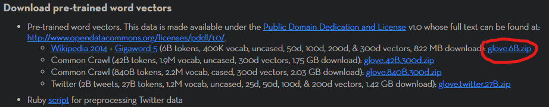
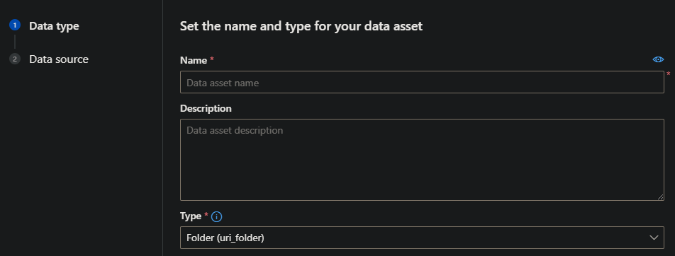
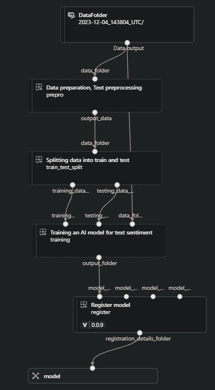
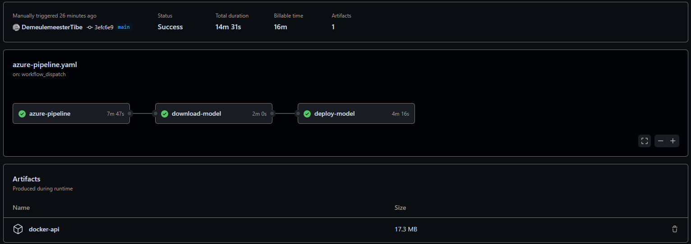
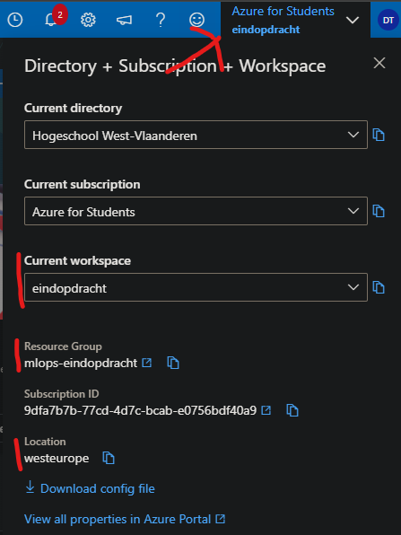

# Mlops-Eindopdracht Tibe Demeulemeester

## Table of Contents

- [Some context](#some-context)
  - [The chosen dataset](#the-chosen-dataset)
  - [The chosen AI model](#the-chosen-ai-model)
  - [Preprocessing steps](#preprocessing-steps)
- [Setting up](#setting-up)
  - [GitHub Secrets](#github-secrets)
  - [Azure Machine Learning](#azure-machine-learning)
- [Azure Pipeline](#azure-pipeline)
  - [Data preparation Text preprocessing Component](#data-preparation-text-preprocessing-component)
  - [Splitting data into train and test Component](#splitting-data-into-train-and-test-component)
  - [Training an AI model for text sentiment Component](#training-an-ai-model-for-text-sentiment-component)
  - [Register model Component](#register-model-component)
- [GitHub Actions](#github-actions)
  - [How to trigger the GitHub Actions Workflow](#how-to-trigger-the-github-actions-workflow)
  - [Environment parameters](#environment-parameters)
  - [Jobs](#jobs)
- [FastAPI](#fastapi)

## Some context

### The chosen dataset

I have chosen for a dataset about emotion sentiment were you have 3 column: **tweet_id** the unique id of the tweet,  **sentiment** were you can see what emotion the text was and **content** the text itself.

### The chosen AI model

The chosen AI model I have chosen is a **Bidirectional LSTM** model with using a preexisting **Glove** Embedding.

### Preprocessing steps

The preprocessing consists of the following steps: 

1. Removing the column **tweet_id**
2. Removing the rows were **content** is the same but has a different sentiment
3. Normalizing the text, which includes:
   - Setting everything to lower case
   - Removing stop words
   - Removing numbers
   - Removing punctuation
   - Removing URLs
   - Lemmatization

## Setting up

### GitHub Secrets 

Firstly you will need to get **AZURE_CREDENTIALS** this will be used to log into the azure CLI you can do this by running the following CLI command.

```bash
az ad sp create-for-rbac --name "myApp" --role contributor --scopes /subscriptions/{subscription-id}/resourceGroups/{resource-group} --json-auth 
```

You will get a JSON that looks like this.

```text
{
    "appId": "<appId>",
    "displayName": "<displayName>",
    "name": "<name>",
    "password": "<password>",
    "tenant": "<subID>"
}
```

Use this as the GitHub Secret for **AZURE_CREDENTIALS**.

Secondly you will need to get the **TOKEN** secret which will be used to login into the **GitHub container registry** 


To get the token you will first have to create a **Personal access token** you can do that by going to your **GitHub settings** then clicking on **developer settings**. After that going to **Personal access token** then **Token (classic)**. Now you are on the page where you can see all your Personal access tokens. you can use an existing one or create a now one by clicking on **Generate new token** again choose the classic version. 


Choose a name for your token and make sure your token has acces to the **repo** section and **write:packages** section now create your token.

Now use the token you have been given as the Repository secret **TOKEN**


### Azure Machine Learning

#### Uploading data to your Azure Machine Learning studio

the dataset you can find here [emotions.csv](dataset/emotions.csv) and the needed word vectors you can find on this website [Glove website link](https://nlp.stanford.edu/projects/glove/) 



download the zip file the only file you need from the zip is the **glove.6B.200d.txt** file 

Now go to the Machine Learning Studio and go to **Data** then click on **Create** then you have something like this. 


Now choose a Name I picked **DataFolder** as my name and use type **Folder (uri_folder)** then click next.
Then choose **From local files** and click next untill you can upload your folder with the dataset file and glove file.

## Azure Pipeline

The pipeline file: [text-sentiment.yaml](pipelines/text-sentiment.yaml)



### Data preparation, Text preprocessing Component

This component is responsible for the data preprocessing. The preprocessing consists of the following steps: 

1. Removing the column **tweet_id**
2. Removing the rows were **content** is the same but has a different sentiment
3. Normalizing the text, which includes:
   - Setting everything to lower case
   - Removing stop words
   - Removing numbers
   - Removing punctuation
   - Removing URLs
   - Lemmatization

The component has some inputs namely:

- **data_folder**: the name of the data folder were the dataset is present
- **language**: What language the data is in 
- **data_name**: The name of the dataset

It also has a output which is a **uri_folder** were the preprocessed data will be present.

The component uses the environment **azureml:aml-Preproccesing:0.1.0** which is a custom environment from the file [preproEnv.yaml](environment/preproEnv.yaml) which will be automatically created or updated if it doesn't exist in the GitHub Actions more about this in the [GitHub Actions](#github-actions) section.

The code of the component you can find here [prepro.py](components/dataprep/code/prepro.py)

### Splitting data into train and test Component

This component creates from a csv file 2 csv files 1 for training and 1 for testing. It splits the data using a given **train_test_split**

The component has the following inputs:

- **data_folder**: the name of the data folder were the preprocessed dataset is present
- **data_name**: The name of the dataset
- **train_test_split**: The amount of procent that should be used for the test size

It also has 2 outputs:
- **training_data_output**: A data asset of the training data
- **testing_data_output**: A data asset of the testing data

The component uses the environment **azureml:aml-DataSplit-Text:0.1.0** which is a custom environment from the file [traintestEnv.yaml](environment/traintestEnv.yaml).

The code of the component you can find here [traintest.py](components/dataprep/code/traintest.py)

### Training an AI model for text sentiment Component

This component outputs a folder with the model and some evaluation metrics from some hyperparameters given to it and the training / testing data.

The component has the following inputs:

- **data_folder**: the name of the data folder were the preprocessed dataset is present
- **data_name**: The name of the dataset
- **training_data**: The training data data asset
- **testing_data**: The testing data data asset
- **glove**: The name of the glove file used for the word vectors embeddings
- **epochs**: How many times it should iterate over the training data 
- **batchsize**: The used batchsize for training
- **valsplit**: The validation split size used for the training
- **patience**: The patience for the earlystopping

It has a **output_folder** of as output.

The component uses the environment **azureml:aml-Training-Text:0.1.0** which is a custom environment from the file [trainingEnv.yaml](environment/trainingEnv.yaml).

The component uses 2 python files [train.py](components/training/code/utils.py) and [utils.py](components/training/code/utils.py)

### Register model Component

This is a premade component from Microsoft to register your model on Azure

The component has the following inputs:
- **model_name**: The name you want to give to your model
- **model_type**: the type of model (in my case is this **custom_model**)
- **model_path**: the path of the folder were your model is in

## GitHub Actions

The GitHub Actions file: [azure-pipeline.yaml](.github/workflows/azure-pipeline.yaml)



### How to trigger the GitHub Actions Workflow

You can trigger the workflow on github under the section **Actions** then clicking on the workflow and clicking **Run workflow** and giving your wanted parameters. 

### Environment parameters 

The workflow has three environment parameters, and you should replace these with your corresponding values in your Azure Machine Learning Studio

- GROUP: is the **Resource Group** in the image
- WORKSPACE: is the **Current Workspace** in the image
- LOCATION: is the **Location** in the image 



### Jobs 

#### Azure Pipeline Step

**outputs:** Defines the output variable (`ai-model`) that can be used in subsequent steps.

**Steps:**
- **Checkout out repository:** Checks out the GitHub repository.
- **Login via Azure CLI:** Authenticates to Azure using the provided **AZURE_CREDENTIALS** in the GitHub repository secrets (See [GitHub Secrets](#github-secrets)).
- **Read yaml files and set output variables:** Reads YAML files to set output variables for Compute name and environment names / versions.
- **Update the component files with the latest environment version:** Updates component files with the latest environment versions.
- **Create or start compute instance:** Creates or starts an Azure ML compute instance.
- **Check and create environments:** Checks for existing environments and creates or updates them.
- **Run the azure ml pipeline:** Runs an Azure ML pipeline if the condition to train the model is met.
- **Set output variable:** Sets the output variable of the step.
- **Stop compute instance:** Stops the Azure ML compute instance.

This workflow integrates with Azure Machine Learning and performs tasks related to environment management, model training, and compute instance handling.


#### Download Model Step

This step depends on the completion of the [Azure Pipeline Step](#azure-pipeline-step) step. It is conditionally executed based on the value of `inputs.download_model`. Below is an explanation of the key components:

**needs:** Indicates that this step depends on the completion of the [Azure Pipeline Step](#azure-pipeline-step).
**if:** Specifies a condition based on the value of `inputs.download_model` to determine whether the step should be executed.

**Steps:**
- **Checkout out repository:** Checks out the GitHub repository.
- **Az CLI login:** Authenticates to Azure using the provided credentials.
- **Download model:** Uses the Azure CLI to download the latest version of the model. It uses the `ai-model` output variable from the [Azure Pipeline Step](#azure-pipeline-step) and downloads the correct model to the `./inference` directory.
- **Upload api code:** Uploads the contents of the `./inference` directory as a Docker API artifact.

This step is responsible for downloading the latest version of the model from Azure Machine Learning and uploading the API code for Dockerization.

#### Deploy Model Step

This step depends on the completion of the [Download Model Step](#download-model-step) step and is conditionally executed based on the success of the [Download Model Step](#download-model-step). Below is an explanation of the key components:

**needs:** Indicates that this step depends on the completion of the [Download Model Step](#download-model-step).
**if:** Specifies a condition based on the success result of the [Download Model Step](#download-model-step) to determine whether the step should be executed.

**Steps:**
- **"Docker metadata":** Uses the `docker/metadata-action` to gather metadata about the Docker image, including tags based on the repository and event.
- **"Login to GHCR":** Logs in to the GitHub Container Registry (GHCR) using the Docker login action with the variables `username` (Is your GitHub repository name) and `TOKEN` (See [GitHub Secrets](#github-secrets)) .
- **"Download API code for Docker":** Downloads the API code for Docker from the `docker-api` artifact.
- **"Docker Build and push":** Uses the `docker/build-push-action` to build and push the Docker image. The image tags are obtained from the `docker-metadata` step.

This step is responsible for deploying the model by building and pushing the Docker image to the GitHub Container Registry (GHCR) based on the downloaded API code.


## FastAPI
