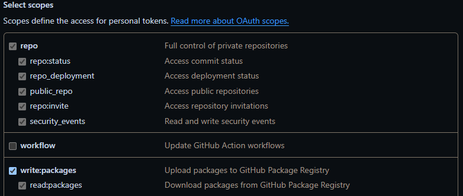
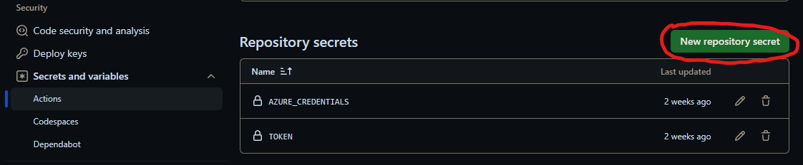

# Mlops-Eindopdracht Tibe Demeulemeester

## Setting up

### GitHub Secrets 

Firstly you will need to get **AZURE_CREDENTIALS** this will be used to log into the azure CLI you can do this by running the following CLI command.

```bash
az ad sp create-for-rbac --name "myApp" --role contributor --scopes /subscriptions/{subscription-id}/resourceGroups/{resource-group} --json-auth 
```

You will get a JSON that looks like this.

```text
{
    "appId": "<appId>",
    "displayName": "<displayName>",
    "name": "<name>",
    "password": "<password>",
    "tenant": "<subID>"
}
```

Use this as the GitHub Secret for **AZURE_CREDENTIALS**.

Secondly you will need to get the **TOKEN** secret which will be used to login into the **GitHub container registry** 


To get the token you will first have to create a **Personal access token** you can do that by going to your **GitHub settings** then clicking on **developer settings**. After that going to **Personal access token** then **Token (classic)**. Now you are on the page where you can see all your Personal access tokens. you can use an existing one or create a now one by clicking on **Generate new token** again choose the classic version. 



Choose a name for your token and make sure your token has acces to the **repo** section and **write:packages** section now create your token.

Now use the token you have been given as the Repository secret **TOKEN**


